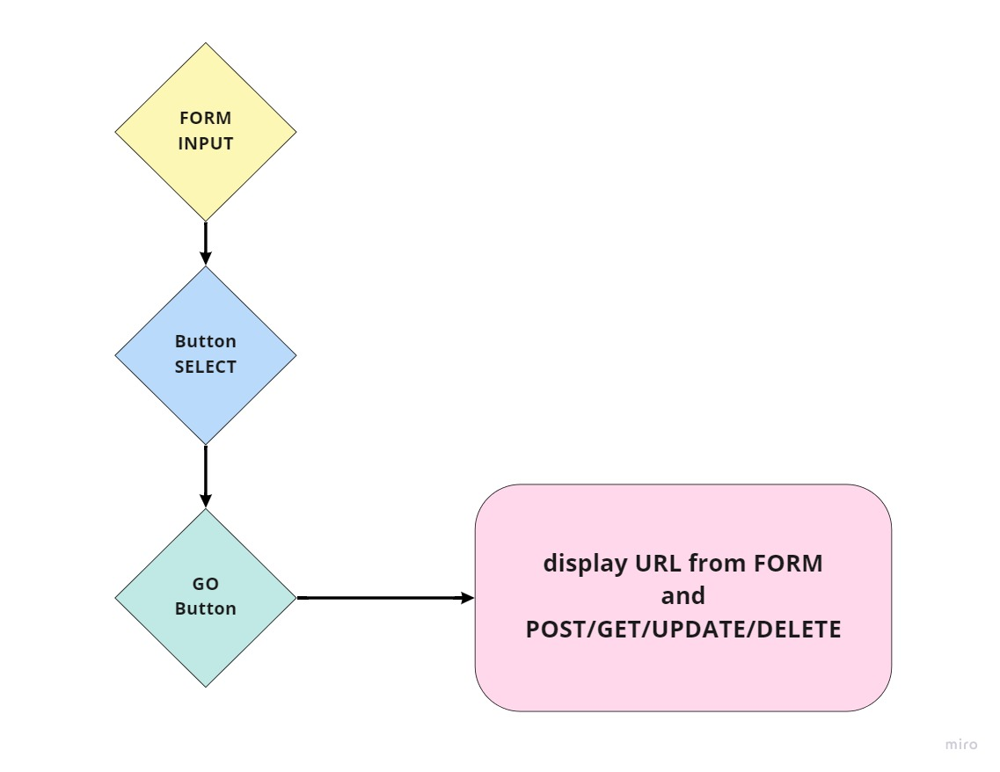
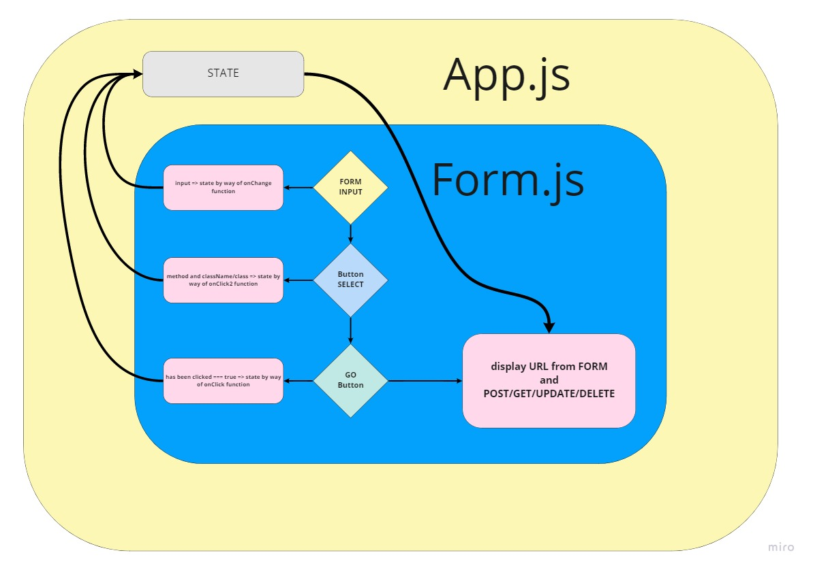

# RESTy react app - swagger clone

react app in 4 stages:

- 1.) text input - transfered to state - printed on screen on same page - add to it GET POST PUT DELETE buttons and display the choice of button clicked on the same page

## Author: Fizzo Pannosch

**Version**: 1.0.0

<!-- (increment the patch/fix version number if you make more commits past your first submission) -->

## 
 links and resources 

### 
 [sandbox deployed site](https://codesandbox.io/s/festive-leaf-t0stu) 

### 
 UML - simple 

### 
 UML - including state 

#### 
 [github link](https://github.com/fizzo999/RESTy) 

#### 
 [github README.md](https://github.com/fizzo999/RESTy/blob/main/README.md) 

#### 
 [merged pull request - github](https://github.com/fizzo999/auth-api/pull/2) 

<!-- ## 
 UML DIAGRAM 

 -->

## Overview

react app in 4 stages:

- 1.) text input - transfered to state - printed on screen on same page - add to it GET POST PUT DELETE buttons and display the choice of button clicked on the same page

## Setup

git clone repo from github link:
https://github.com/fizzo999/RESTy.git

npm install
(to install dependencies: react, react-dom, react-scripts)

Running the app
npm run start (will run react-scripts start)

## Tests

npm run test

- will run the command "react-scripts test --verbose --coverage"

## Architecture

react based jsx frontend that displays user input (as a runner up to server REST / CRUD request methods (POST, GET, PUT, DELETE))

tests performed with jest through react-scripts

## Change Log

05-24-2021 9:59pm - Application now has a fully-functional frontend displaying user input plus choice of REST method - buttons to show up as h2/h3 on the page - all managed through state - transfered up through use of a class method/ function.

## Credits and Collaborations

- Number and name of feature: setup file structure, write index.html, index,js, App.js, Form.js, Header.js, Footer.js PLUS all the scss files (for each file)- repo on github and deploy to sandbox
- Estimate of time needed to complete: 2 hours
- Start time: 4:00 pm
- Finish time: 8:00 pm
- Actual time needed to complete: 4 hours
